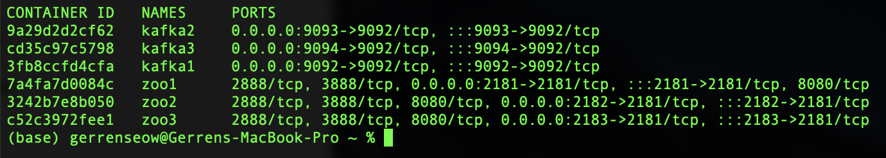
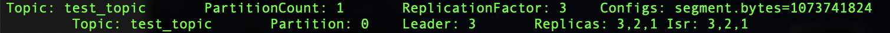
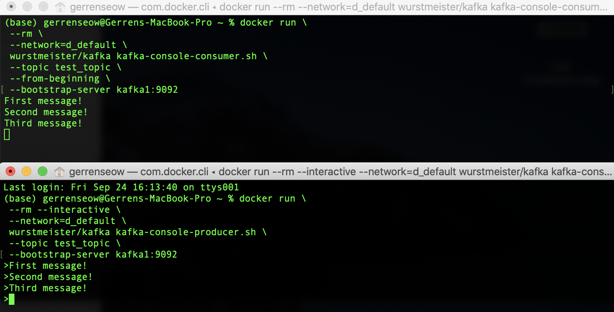
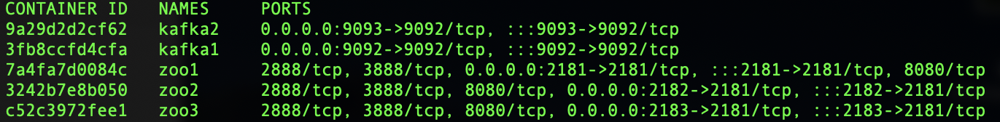
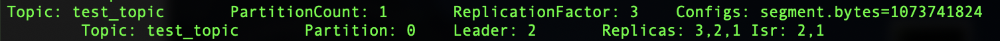
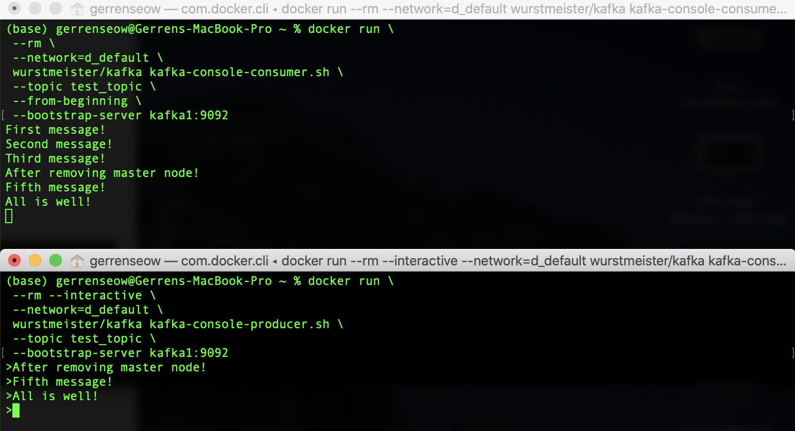

# Task D: Pub-Sub Messaging

This task is completed with a 3-node Apache Kafka cluster using Docker, together with a Zookeeper ensemble used to manage the cluster.

## Instructions for setup
1. Ensure Docker and Docker Compose is installed in your workstation
2. Clone this repository
  
        git clone https://github.com/jerrenss/CS3219-OTOT-Assignment.git

3. Navigate to the root folder of Task D

        cd D
    
4. Launch the containers with Docker Compose

        docker-compose up

5. Once development work is complete, tear down containers with Docker Compose

        docker-compose down -v

## Producer and Consumer Messaging
Here are the series of steps and screenshots used to demonstrate messaging between a producer and consumer, with Apache Kafka
1. Check that all containers are up and running. There should be 3 Kafka and 3 Zookeper containers.
  
        docker ps --format "table {{.ID}}\t{{.Names}}\t{{.Ports}}"

    

       
    

   
2. Check that test topic has been automatically created. We can observe the replication factor of the topic, its partition count and master node, which are 3, 1 and 3 in this case.
  
        docker run \
        --rm \
        --network=d_default \
        wurstmeister/kafka kafka-topics.sh \
        --describe \
        --topic test_topic \
        --bootstrap-server kafka1:9092

    

       
    

   
3. Create a consumer which subscribes to **test_topic**.
  
        docker run \
        --rm \
        --network=d_default \
        wurstmeister/kafka kafka-console-consumer.sh \
        --topic test_topic \
        --from-beginning \
        --bootstrap-server kafka1:9092

4. In another terminal, create a producer which sends messages to **test_topic**.

        docker run \
        --rm --interactive \
        --network=d_default \
        wurstmeister/kafka kafka-console-producer.sh \
        --topic test_topic \
        --bootstrap-server kafka1:9092

5. In the producer terminal, type messages to send. You should see these messages appear in the consumer terminal almost immediately. In the following example, the consumer terminal is on top and the producer terminal is below.

    

       
    

## Successful Management of Master Node Failure 
Here are the series of steps and screenshots used to demonstrate messaging between a producer and consumer, with Apache Kafka
1. Kill the master Kafka node, which is this case is node 3.
  
        docker stop kafka3

2. Verify that container kafka3 is no longer running.
  
        docker ps --format "table {{.ID}}\t{{.Names}}\t{{.Ports}}"

    

       
    
 

3. Verify that a new master node took over, which in this case is node 2.
  
        docker run \
        --rm \
        --network=d_default \
        wurstmeister/kafka kafka-topics.sh \
        --describe \
        --topic test_topic \
        --bootstrap-server kafka1:9092

    

       
    
 

4. Repeat steps 3 - 5 in previous section **Producer and Consumer Messaging**. You should see that communication carries on as per normal after the replacement of master node.

    

       
    

